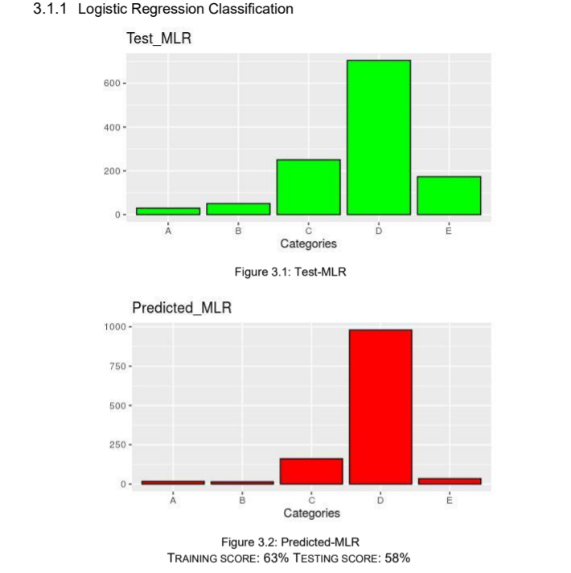
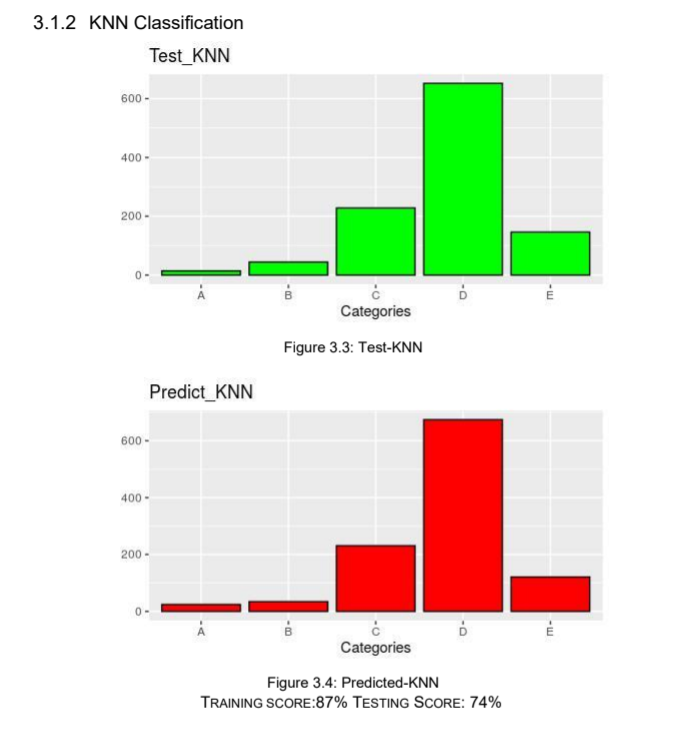
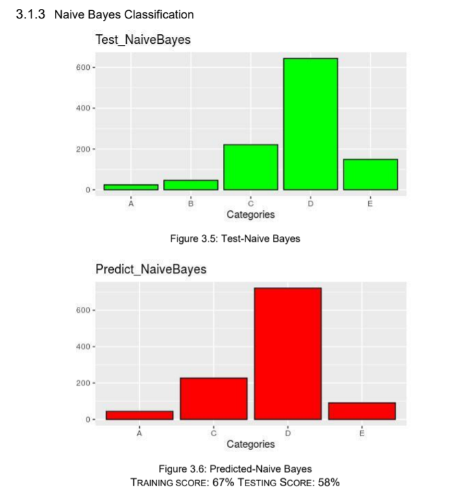
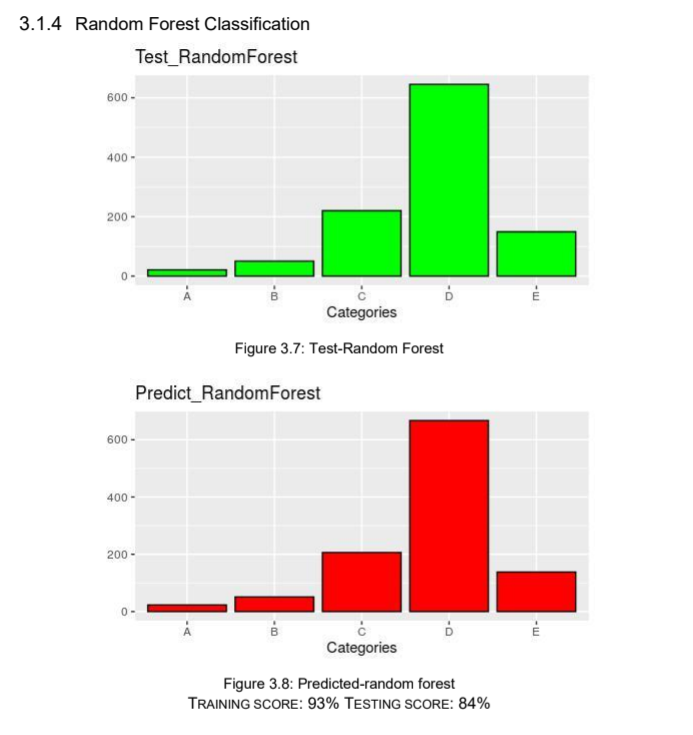

# Path-Loss-Prediction-Based-on-Machine-Learning-Principle-Method-and-Data-Expansion

## Abstract
> This paper presents a novel application of various
machine learning (ML)-based approaches towards prediction of
path loss (PL) parameter for a smart campus environment.
Measured data from [1] are used to train and evaluate the
performance of popular ML techniques such as artificial neural
network (ANN) and random forest (RF). Simulation results are
presented to verify the PL prediction accuracy of the ML-based
schemes. Further, a detailed comparison with the widely used
empirical COST-231 Hata model demonstrates the superiority
over conventional techniques thereby validating the suitability of
employing ML for path loss prediction in challenging 5G wireless
scenarios.
**Index Terms** — Machine learning, path loss, artificial neural
network, random forest, 5G scenarios.

### Codes
In this project the following classification and regression algorithm is used:

* Logistic Regression
* KNN Classification
* Linear Regression
* Naive Bayes Classification
* Random Forest
* Artificial Neural Network

### The following results based on the various algorithm:

> 

> 

> 

> 

> 
